# invos-mock-demo — Codebase Guide

> A single-document tour of the whole system for an engineer joining the project.
> It explains *what* each component does, *why* it exists, and *how* the pieces fit
> together. Diagrams are preferred over prose wherever a relationship or a flow is
> involved. Where behavior is inferred rather than stated in code, it is flagged with
> **(assumption)**.

---

## Table of contents

1. [Project Overview](#project-overview)
2. [Directory Structure](#directory-structure)
3. [Module Documentation](#module-documentation)
   - [Data generator (`generator/`)](#data-generator-generator)
   - [Ingestion server (`server/`)](#ingestion-server-server)
   - [Database (`db/`)](#database-db)
   - [Load test (`loadtest/`)](#load-test-loadtest)
   - [Monitoring (`monitoring/`)](#monitoring-monitoring)
   - [Orchestration (`scripts/`, `Makefile`, `docker-compose.yml`)](#orchestration)
4. [Data Models](#data-models)
5. [API Endpoints](#api-endpoints)
6. [Runtime Flow](#runtime-flow)
7. [Call Graphs](#call-graphs)
8. [State Machines](#state-machines)
9. [Concurrency](#concurrency)
10. [External Dependencies](#external-dependencies)
11. [Configuration](#configuration)
12. [Potential Improvements](#potential-improvements)
13. [Summary](#summary)

---

## Project Overview

### Purpose

`invos-mock-demo` is a **self-contained demonstration of an event-ingestion + observability
pipeline**, modelled on Taiwanese electronic invoices (e-invoices). It exists to show, end to
end and on a single laptop:

- realistic, **deterministic** synthetic data generation (with a *known, injected* signal — an
  ad campaign — so detection can be checked against ground truth);
- an **idempotent ingestion API** that validates and persists data and exposes Prometheus
  metrics;
- **open-model load testing** that proves the API's behavior under pressure; and
- **monitoring-as-code** (Prometheus + Grafana) that observes *both* the service (via
  `/metrics`) and the data (via SQL).

It is explicitly a demo: demo-only credentials, anonymous Grafana access, Docker Compose (no
Kubernetes), and no auth hardening. The repository was built in five numbered steps (preserved
in `steps/`), and the running code implements all five.

### Major responsibilities

| Subsystem | Responsibility | Language / tech |
| --- | --- | --- |
| `generator/` | Emit deterministic mock invoices as NDJSON, with an optional ad-campaign effect + ground truth | Python 3.12, NumPy, Faker, PyArrow |
| `server/` | Validate + idempotently persist invoices; expose stats + Prometheus metrics | Node.js 20, Fastify 5, `pg`, `prom-client` |
| `db/` | PostgreSQL schema (two tables + indexes) as plain SQL migrations | SQL (PostgreSQL 16) |
| `loadtest/` | Replay invoices at the API under four load profiles, asserting thresholds | Grafana k6 (JS) |
| `monitoring/` | Prometheus scrape config + Grafana datasources & two dashboards, provisioned as code | Prometheus, Grafana |
| `scripts/`, `Makefile` | One-command demo orchestration and load-test convenience targets | Bash, Make |

### High-level architecture

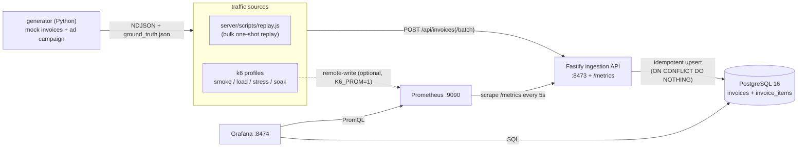

The defining idea: **Prometheus and Grafana observe both sides** — the *service* (latency, error
rates, Node vitals via `/metrics`) and the *data* (daily revenue, campaign lift via SQL). k6 can
push its own offered-load metric into Prometheus so the "offered rate vs. server-observed rate"
overlay becomes the visual proof of open-model load testing.

### Main execution flow

The canonical path, captured by `scripts/demo.sh`:

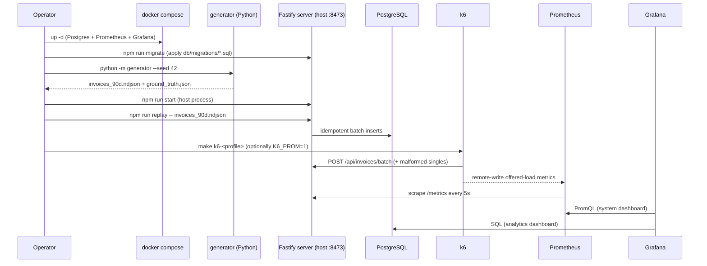

---

## Directory Structure

```mermaid
graph TD
  root["invos-mock-demo/"]
  root --> generator["generator/ — Python data generator"]
  root --> server["server/ — Fastify ingestion API"]
  root --> db["db/migrations/ — SQL schema"]
  root --> loadtest["loadtest/ — k6 load profiles"]
  root --> monitoring["monitoring/ — Prometheus + Grafana as code"]
  root --> scripts["scripts/ — demo.sh / stop-demo.sh"]
  root --> steps["steps/ — the 5 build specs"]
  root --> compose["docker-compose.yml"]
  root --> makefile["Makefile — k6 targets"]

  server --> ssrc["src/ (app, routes, schemas, ingest, db, metrics)"]
  server --> sscripts["scripts/ (migrate.js, replay.js)"]
  server --> stest["test/ (node:test suites)"]
  generator --> gpkg["generator/ (population, campaign, invoices, cache, __main__)"]
  generator --> gdata["data/ (NDJSON + ground_truth + Parquet cache, git-ignored)"]
  monitoring --> mprom["prometheus/prometheus.yml"]
  monitoring --> mgraf["grafana/ (provisioning + dashboards)"]
  loadtest --> lprofiles["profiles/ (smoke, load, stress, soak)"]
  loadtest --> llib["lib/ (payloads.js, checks.js)"]
```

Per-directory purpose and cross-references:

| Directory | Purpose | Talks to |
| --- | --- | --- |
| `generator/` | Deterministic invoice generation → NDJSON. Pure compute; only `__main__.py` touches the filesystem. Has its own `uv`-managed venv, `config.yaml`, and Parquet cache. | Output consumed by `server/scripts/replay.js` and `loadtest/prepare.js`. |
| `server/src/` | The Fastify app: route plugins, JSON schemas, shared ingest logic, DB pool, metrics registry. | Reads/writes `db/` tables; serves Prometheus on `/metrics`. |
| `server/scripts/` | Operational scripts outside the request path: `migrate.js` (schema), `replay.js` (bulk load). | Apply `db/migrations/`; POST to the running API. |
| `server/test/` | `node:test` suites run against the live compose Postgres. | Build the app via `buildApp()`, hit it with `app.inject()`. |
| `db/migrations/` | Plain `.sql` files applied in filename order by `migrate.js`. | Defines the schema the server and dashboards depend on. |
| `loadtest/` | k6 profiles + shared library + NDJSON→JSON preparer + post-run SQL checks. | Drives the API; optionally remote-writes to Prometheus. |
| `monitoring/` | Prometheus scrape config and Grafana datasources + dashboards, all as code. | Scrapes the server; queries Prometheus and Postgres. |
| `scripts/` | `demo.sh` (full pipeline up) and `stop-demo.sh` (tear down). | Orchestrates every other directory. |
| `steps/` | The five original build specs (documentation only; not executed). | Reference for *why* each piece exists. |

> **Convention (from `CLAUDE.md`):** every first-level subfolder carries a `README.md`, and any
> generated/cached artifact is git-ignored (e.g. `generator/data/`, `loadtest/data/`,
> `node_modules/`).

---

## Module Documentation

### Data generator (`generator/`)

A small pipeline of pure modules — **population → campaign → invoices** — orchestrated by a CLI
that owns all I/O and a cache layer that memoizes the (expensive) generation.

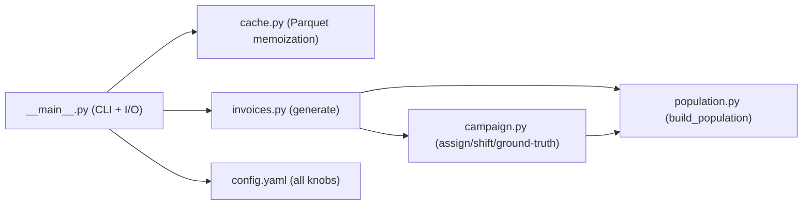

Design principle: **one NumPy `Generator` drives every random draw**, so `same seed + same
config ⇒ byte-identical NDJSON`. The modules never touch disk or network except `__main__.py`.

---

#### `generator/generator/__main__.py`

##### Purpose
CLI entry point (`uv run python -m generator`). Loads `config.yaml`, decides cache-vs-regenerate,
writes the NDJSON and (when the campaign is on) `ground_truth.json`, and prints a summary. The
**only** module that performs file I/O.

##### Dependencies
- Internal: `cache`, `invoices.generate`.
- External: `argparse`, `json`, `os`, `sys`, `yaml`.

##### Functions

- **`_parse_args(argv) -> Namespace`** — defines flags: `--config`, `--out`, `--seed`,
  `--cache-dir`, `--regenerate` (force fresh, overwrite cache), `--no-cache` (never read/write
  cache, in-memory only).
- **`write_ndjson(invoices, path) -> None`** — writes one JSON object per line with
  `sort_keys=True` (stable key order is what makes the output byte-reproducible) and
  `ensure_ascii=False`. Creates the parent dir.
- **`main(argv=None) -> int`** — the orchestration:

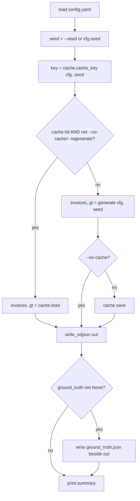

#### `generator/generator/__init__.py`
Re-exports `generate` so `from generator import generate` works. `__all__ = ["generate"]`.

#### `generator/generator/population.py`

##### Purpose
Builds the synthetic shopper population and the seller catalog. Pure: given `(cfg, rng, faker)`
it returns a `Population`. Indexing convention: arrays are indexed by **household id** (`0..n-1`)
unless noted.

##### Data class — `Population`
| Field | Shape / type | Meaning |
| --- | --- | --- |
| `carrier_ids` | `list[str]` | stable `'/'+7-char` mobile-barcode carrier per household (acts as the household identity in the data) |
| `multipliers` | `ndarray (n,)` | per-household shopping-frequency multiplier ~ `Gamma(shape, scale)` |
| `preferred_stores` | `list[ndarray]` | per household: array of 3–5 distinct store indices |
| `brand_weights` | `ndarray (n, n_brands)` | per-household toothpaste brand preference (rows sum to 1) |
| `store_names`, `store_tax_ids` | `list[str]` | seller catalog, indexed by store id |
| `brands` | `list[str]` | toothpaste brand names, indexed by brand id |
| `size` (property) | `int` | `len(carrier_ids)` |

##### Functions
- **`_gen_carrier_id(rng)`** — `'/'` + 7 chars from `[0-9A-Z+-.]`.
- **`_gen_tax_id(rng)`** — 8 random digits.
- **`build_store_catalog(cfg, rng, faker)`** — `stores_in_catalog` company names (Faker) with
  **catalog-unique** tax ids (rejection-samples collisions).
- **`build_population(cfg, rng, faker) -> Population`** — the core:
  - carrier ids per household;
  - `multipliers` from `Gamma(frequency_gamma_shape, frequency_gamma_scale)` (default mean 1.0,
    right-skewed → a few heavy shoppers);
  - `preferred_stores`: `choice(n_stores, k, replace=False)` with `k ∈ [min,max]`;
  - `brand_weights`: random base `+0.1`, **bump each household's favorite brand by +2.0**, then
    row-normalize → every household has a genuine preferred brand.

#### `generator/generator/campaign.py`

##### Purpose
The optional **ad-campaign effect** — the signal later dashboards must detect. Decides which
households are exposed, how their toothpaste behavior shifts after the campaign start day, and
emits the ground-truth record so detection can be validated against the truth.

##### Data class — `Campaign`
`enabled`, `start_day`, `lift`, `brand_index`, `brand_shift`, `exposed` (bool mask `(n,)`).

##### Functions
- **`assign_campaign(cfg, rng, pop) -> Campaign`** — randomly marks `exposed_fraction` of
  households as exposed; resolves the promoted brand's index. When disabled, the mask is all-False.
- **`shifted_brand_weights(pop, campaign) -> ndarray`** — for exposed households, moves a
  `brand_shift` fraction of probability mass onto the promoted brand
  (`weights *= (1-s); weights[:, b] += s`). Everyone else keeps their preference. Returns a copy.
- **`is_campaign_active(campaign, day, household) -> bool`** — `enabled AND day >= start_day AND
  exposed[household]`. This gate is what makes the lift switch on at `start_day`.
- **`build_ground_truth(cfg, pop, campaign) -> dict`** — serializable truth: parameters plus the
  full list of **exposed carrier ids** and counts. This is the file the analytics layer is
  checked against.
- **`_start_date_for_day(cfg, day)`** — maps a simulated day index to a calendar date for
  human-readable truth.

#### `generator/generator/invoices.py`

##### Purpose
The **orchestrator**. Simulates `days` of shopping for the whole population and emits invoice
dicts matching the DB schema, chronologically sorted. No I/O.

##### Key functions
- **`_bimonthly_prefix(d)`** — two letters that rotate per bimonthly period (Jan–Feb, Mar–Apr…).
  This is *deliberately* not unique year-round — it mirrors real TW invoice numbers and is why
  the DB natural key is `(invoice_number, invoice_date)`, not the number alone.
- **`_invoice_number`, `_random_code`** — format-valid identifiers.
- **`_make_item(category, brand, cfg, rng, …)`** — one line item; `amount = unit_price *
  quantity`, so totals are internally consistent **by construction** (the server later re-checks).
- **`generate(cfg, seed) -> (invoices, ground_truth)`** — the simulation loop:

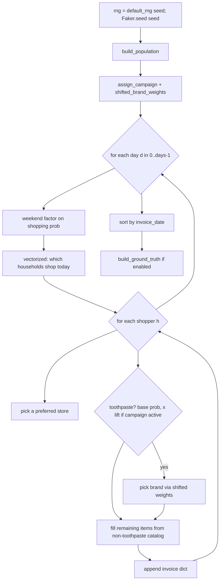

The daily shopping decision is **vectorized**: `probs = clip(base_rate * multipliers * weekend,
0, 1)` and `shoppers = where(uniform(n) < probs)`. Only the per-shopper item construction loops.

#### `generator/generator/cache.py`

##### Purpose
Parquet memoization of generated datasets (default run ≈18 s). A cache entry is two files keyed
by a hash of `(config, seed)`:
- `<key>.parquet` — invoices (nested `list<struct>` for items, via `pa.Table.from_pylist`);
- `<key>.gt.json` — the ground truth (removed when the campaign is off).

##### Functions
- **`cache_key(cfg, seed)`** — `sha256(canonical_json({config, seed}))[:16]`. Canonical
  (sorted-keys) JSON makes the hash order-independent; **any** config/seed change invalidates the
  cache, so stale data is never silently reused.
- **`cache_paths` / `is_cached`** — path helpers / existence check.
- **`save(...)`** — writes zstd-compressed Parquet (stashing the key in schema metadata as a
  cross-check) and the optional ground-truth sidecar (deleting a stale one if the campaign was
  turned off for this key).
- **`load(...)`** — `read_table(...).to_pylist()` round-trips back to identical Python dicts,
  plus the sidecar if present.

#### `generator/tests/`
- **`conftest.py`** — `load_config()` (real `config.yaml`) and `small_config()` (2,500
  households × 60 days, campaign start day 20) so tests run fast but stay statistically
  meaningful.
- **`test_generator.py`** — covers: determinism (same seed ⇒ identical serialization *and*
  hash-equal file), seed sensitivity, invoice-number format, totals add up, chronological order,
  required fields, **Parquet cache round-trip is byte-identical**, cache-key sensitivity, the CLI
  uses the cache by default (monkeypatches `generate` to *raise* on a warm cache), and a
  **two-proportion z-test** asserting exposed households have a significantly higher
  post-campaign toothpaste rate (`p < 0.01`).

---

### Ingestion server (`server/`)

A Fastify 5 app built as a factory (`buildApp`) so tests can `inject()` without binding a port.
Route plugins are thin; validation + persistence live in `ingest.js`; metrics live in a shared
registry.

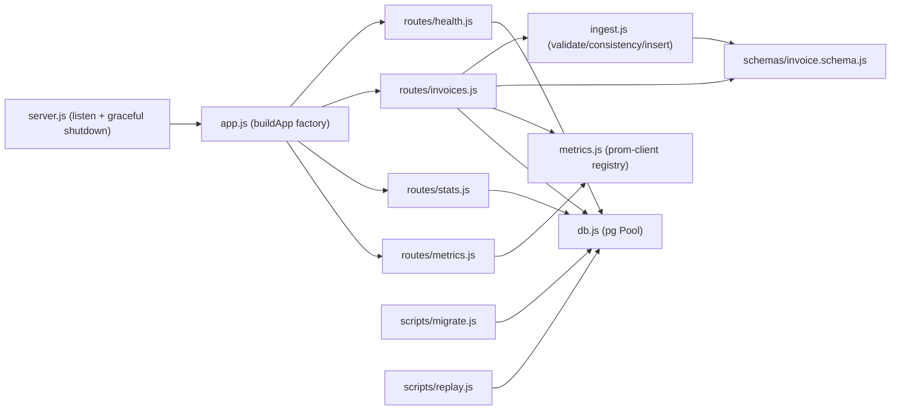

#### `server/src/app.js`
##### Purpose
Fastify **application factory**. Builds the app *without* listening. Critically sets Ajv
`removeAdditional: false` so unknown fields are **rejected** (combined with
`additionalProperties:false` schemas) instead of Fastify's default of silently stripping them —
the app is a strict gatekeeper. Registers the four route plugins.

#### `server/src/server.js`
##### Purpose
Process entry point. Builds the app, reads `PORT` (default **8473** — uncommon, to dodge
3000/8080 collisions) and `HOST`, listens, and installs `SIGINT`/`SIGTERM` handlers that
`app.close()` then `pool.end()` for a clean shutdown (no leaked connections).

#### `server/src/db.js`
##### Purpose
The single shared `pg.Pool` (one pool per process). Config precedence: `DATABASE_URL` if set,
else `PG*` vars with **localhost demo defaults** (`invos`/`devonly`/`invoices`) matching
`docker-compose.yml`.
##### Notable behavior
- Registers a `pool.on('error')` handler that **logs and swallows** idle-client errors. Without
  it, node-postgres turns a dead backend into an unhandled `error` event that crashes the
  process; swallowing lets `/healthz` keep returning 503 instead.
- **`pingDb()`** — `SELECT 1`; returns `true`/`false`. Used by the health route.

#### `server/src/ingest.js`
##### Purpose
The shared core used by **both** the single and batch routes, so they behave identically.
##### Functions
- **`validateInvoice(invoice) -> {valid, reason?}`** — a *standalone* Ajv validator (with
  `ajv-formats` for the `date` format). The batch path uses this for **per-item partial success**
  rather than failing the whole request; the single path relies on Fastify's own Ajv.
- **`consistencyError(invoice) -> string|null`** — server-side gate: `Σ items.amount` must equal
  `total_amount`. A mismatch means corrupt/forged data → the route returns **422**.
- **`insertInvoice(client, invoice) -> {status, id?}`** — idempotent transactional insert using
  a caller-provided (already-in-transaction) client:
  - `INSERT … ON CONFLICT (invoice_number, invoice_date) DO NOTHING RETURNING id`;
  - `rowCount === 0` ⇒ `{status:'duplicate'}` (items skipped);
  - otherwise bulk-inserts all items in **one** multi-row statement and returns
    `{status:'created', id}`.

#### `server/src/schemas/invoice.schema.js`
##### Purpose
JSON Schemas (Ajv) for ingestion. `additionalProperties:false` everywhere → unexpected fields
are rejected.
- **`item`** — `description`, `category` (non-empty), nullable `brand`, integer `quantity`/
  `unit_price`/`amount` (≥0).
- **`invoiceSchema` / `singleBody`** — full invoice: `invoice_number` `^[A-Z]{2}[0-9]{8}$`,
  `invoice_date` ISO `date`, `random_code` `^[0-9]{4}$`, `seller_tax_id` `^[0-9]{8}$`,
  nullable `carrier_id`, integer `total_amount`, `items` 1–50.
- **`batchBody`** — *intentionally loose*: an array of 1–500 generic objects. The per-item schema
  runs in the handler so one bad invoice can't 400 the whole batch.

#### `server/src/routes/invoices.js`
##### Purpose
The two ingestion endpoints. A per-route `errorHandler` (`validationErrorHandler`) converts
Fastify's schema-validation failures into a structured `400 {error:'validation_failed', details}`
and records the reject metric.

- **`POST /api/invoices`** (single): Fastify validates the body → `consistencyError` (422 on
  mismatch) → `BEGIN`/`insertInvoice`/`COMMIT`. Returns **201 created** / **200 duplicate** /
  **422** / **500** (rollback on DB error). Every branch records `requestsTotal`,
  `invoicesTotal`, and stops the duration timer.
- **`POST /api/invoices/batch`** (≤500): a no-DB first pass runs per-item `validateInvoice` +
  `consistencyError`, collecting `{index, reason}` rejects (partial success). Accepted invoices
  are inserted in **one transaction** — a DB error rolls back the whole batch (atomic). Returns
  `200 {created, duplicates, rejected}`.

#### `server/src/routes/stats.js`
##### Purpose
Read-back aggregates for sanity checks and the Grafana SQL dashboard. Query strings are
schema-validated; SQL is parameterized.
- **`GET /api/stats/daily?from&to`** → `[{day, invoice_count, total_amount}]`, grouped/ordered by
  `invoice_date`. `bigint` sums are normalized to JS `number`.
- **`GET /api/stats/category-daily?category&from&to`** → `[{day, category, quantity, amount}]`,
  joining `invoice_items` to `invoices`. `category` is optional (omit it to get every category).

#### `server/src/routes/health.js`
**`GET /healthz`** → `200 {status:'ok', db:true}` when `pingDb()` succeeds, else `503
{status:'error', db:false}` — signals unhealthy without crashing.

#### `server/src/routes/metrics.js`
**`GET /metrics`** → serializes the shared `prom-client` registry in Prometheus text format
(`registry.contentType` header). This is the scrape target.

#### `server/src/metrics.js`
##### Purpose
One process-wide `prom-client` Registry. Enables default Node metrics (event-loop lag, heap, CPU,
GC) and defines the three Step-3 custom metrics:
| Metric | Type | Labels | Meaning |
| --- | --- | --- | --- |
| `invos_ingest_requests_total` | Counter | `route`, `status` | ingestion HTTP requests |
| `invos_ingest_invoices_total` | Counter | `result` (created/duplicate/rejected) | per-invoice outcomes |
| `invos_ingest_duration_seconds` | Histogram | `route` | request latency; buckets centered around the ~20 ms target so p95 is observable |

#### `server/scripts/migrate.js`
##### Purpose
A **framework-free migration runner**. Creates `schema_migrations(filename, applied_at)`, reads
`db/migrations/*.sql` in filename order, skips already-applied files, and runs each new file in
its own transaction (recording it on success, rolling back + aborting on failure). Idempotent and
safe to re-run.

#### `server/scripts/replay.js`
##### Purpose
Bulk-replays a Step-2 NDJSON file at the API to prove the full path. Streams the file line by
line into batches of `BATCH_SIZE` (200), posts to `/api/invoices/batch` with **bounded
concurrency** (`CONCURRENCY`, default 4) via an in-flight `Set` + `Promise.race`, folds results,
then reads back DB row counts and prints `{sent, created, duplicates, rejected, elapsed_s,
db_invoices, db_items}`. No external deps (Node `fetch` + `readline`).

#### `server/test/`
`node:test` suites run against the **live compose Postgres**:
- **`health.test.js`** — factory builds; `/healthz` returns `db:true`.
- **`invoices.test.js`** — schema 400s (bad number, unknown field), consistency 422, idempotent
  201→200, batch partial-success accounting. Uses far-future `2099-*` dates so cleanup never
  touches replayed data.
- **`stats.test.js`** — seeds a 3-invoice `2098-*` fixture and asserts both stats endpoints.
- The two suites use **disjoint date bands** (2098 vs 2099) so concurrent `node --test` processes
  don't race on cleanup.

---

### Database (`db/`)

#### `db/migrations/001_init.sql`
Creates `invoices` and `invoice_items` (see [Data Models](#data-models)), the
`(invoice_number, invoice_date)` UNIQUE natural key, the `invoice_items → invoices` FK with
`ON DELETE CASCADE`, and base indexes on `invoices(invoice_date)`,
`invoice_items(category)`, `invoice_items(invoice_id)`. Idempotent via `IF NOT EXISTS`.

#### `db/migrations/002_stats_indexes.sql`
Adds a composite `invoice_items(category, invoice_id)` index so `category-daily` satisfies the
category filter and the item-side join without a full scan.

---

### Load test (`loadtest/`)

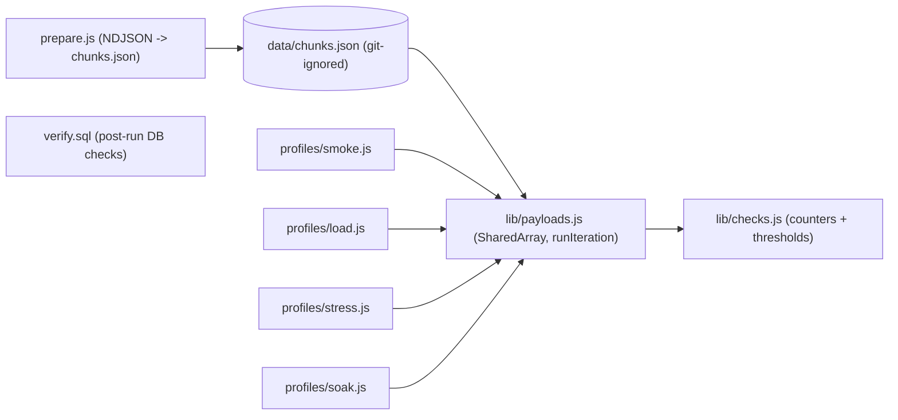

#### `loadtest/prepare.js`
Converts the Step-2 NDJSON into a single JSON array (`data/chunks.json`, capped at
`MAX_INVOICES`=100k) — the shape k6's `SharedArray` wants. Streams in and writes the array out
incrementally so neither the source text nor a giant in-memory array is held whole.

#### `loadtest/lib/payloads.js`
The heart of one VU iteration:
- Loads `chunks.json` **once** via `SharedArray` (parsed in init context, shared read-only across
  all VUs — avoids each of hundreds of VUs holding its own GB-scale copy).
- **`runIteration()`** builds `BATCH_SIZE` (50) payloads. With probability `MALFORMED_RATE` (2%)
  an invoice is corrupted by `makeMalformed` (rotating three failure modes: drop a required field
  → 400; lowercase the number → 400; corrupt the total → 422). Healthy invoices go to the **batch**
  endpoint (asserting `200` and `no 5xx`); malformed go to the **single** endpoint one at a time
  (asserting `4xx` and `never 5xx`).
- Folds API responses into custom counters; tags healthy traffic `expected:ok` and malformed
  `expected:reject` so the 4xx of intentional rejects never counts against the failure threshold.
- `pickInvoice()` deliberately allows redraws (the API is idempotent, so duplicates are expected
  and measured, not avoided).

#### `loadtest/lib/checks.js`
Defines the four custom counters (`invos_created/duplicates/rejected/malformed_sent`) and a
**`thresholds(...)` factory**: latency `p95<250 / p99<500` and `http_req_failed<0.001`, both
scoped to `{expected:ok}`; `checks: rate>0.99`. `abortOnFail` (used by stress) wraps each
threshold so k6 stops at the first breach.

#### `loadtest/profiles/*.js`
All open-model (arrival-rate) executors — a slowing server can't silently reduce offered load:
| Profile | Executor | Shape | Intent |
| --- | --- | --- | --- |
| `smoke` | constant-arrival-rate | 5 rps, 1 min | correctness gate before real load |
| `load` | ramping-arrival-rate | 0→100 rps over 2 min, hold 10 min | defines "healthy" |
| `stress` | ramping-arrival-rate | step 100→200→400→800 rps, `abortOnFail` | find the wall |
| `soak` | constant-arrival-rate | 50 rps, 60 min | leaks / drift over time |

#### `loadtest/verify.sql`
Five PASS/FAIL post-run checks: no duplicate natural keys, no orphan items, every invoice has
items, stored totals match line-item sums, and a per-day distribution (span/shape unchanged by
replay).

---

### Monitoring (`monitoring/`)

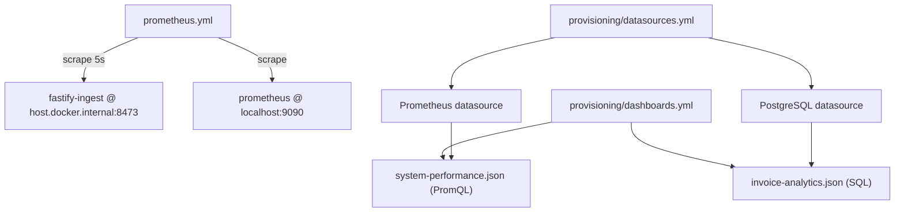

- **`prometheus/prometheus.yml`** — 5 s scrape interval; one job scrapes the host server's
  `/metrics` via `host.docker.internal:8473`, plus a self-scrape. k6 metrics arrive via the
  remote-write *receiver* (enabled in compose), not by scraping.
- **`grafana/provisioning/datasources.yml`** — two datasources as code: Prometheus
  (`http://prometheus:9090`, default, `timeInterval: 5s`) and PostgreSQL (`postgres:5432`,
  read-only by intent, demo credentials).
- **`grafana/provisioning/dashboards.yml`** — file provider that auto-loads everything in the
  mounted dashboards folder into the `invos-mock-demo` folder, re-reading every 10 s.
- **`grafana/dashboards/system-performance.json`** (PromQL) — request rate by status, latency
  p50/p95/p99 (`histogram_quantile` over the duration buckets), invoice outcome rates, Node
  event-loop/heap/CPU, and the headline **`k6_http_reqs_total` offered rate vs.
  `invos_ingest_requests_total` server-observed rate** overlay.
- **`grafana/dashboards/invoice-analytics.json`** (SQL) — daily count & revenue, top categories,
  weekend lift (avg invoices per day-of-week), and **toothpaste daily quantity by brand** with the
  PearlGuard lift visible after `2025-02-15` (= `start_date 2025-01-01` + `start_day 45`). All
  panels aggregate by `invoice_date` (event time), not `created_at` (ingest time).

---

### Orchestration

#### `docker-compose.yml`
Three services: **postgres** (16, demo creds, `pg_isready` healthcheck, named volume),
**prometheus** (v2.55.1, remote-write receiver enabled, 6 h retention, `host.docker.internal`
mapped to `host-gateway` so it can scrape the host server on Linux), and **grafana** (11.3.0,
anonymous viewer, host port `${GRAFANA_PORT:-8474}`→3000, provisioning + dashboards mounted
read-only). The **Fastify server runs on the host, not in compose** — that's what lets Prometheus
scrape it via `host.docker.internal`.

#### `Makefile`
k6 convenience targets (`k6-smoke/load/stress/soak`) that `cd loadtest` first (so k6's `open()`
resolves the data file), a `k6-prepare`/`k6-data` guard that builds `chunks.json` on first run,
and `k6-verify` (pipes `verify.sql` into the compose Postgres). `K6_PROM=1` appends the
Prometheus remote-write output flag.

#### `scripts/demo.sh` / `scripts/stop-demo.sh`
- **`demo.sh`** — the 7-step "5-minute" path: compose up → wait for Postgres → install + migrate
  → generate (campaign ON) → start host server (PID/logs in `/tmp`) → replay → run a k6 profile
  with remote-write → print Grafana URLs. Re-runnable (ingestion is idempotent). Knobs:
  `K6_PROFILE`, `SKIP_K6`, `SEED`.
- **`stop-demo.sh`** — the inverse: kill the host server (by PID file, else whatever listens on
  :8473), `pkill k6`, and `docker compose down` (`WIPE_DATA=1` adds `-v` to drop volumes).

---

## Data Models

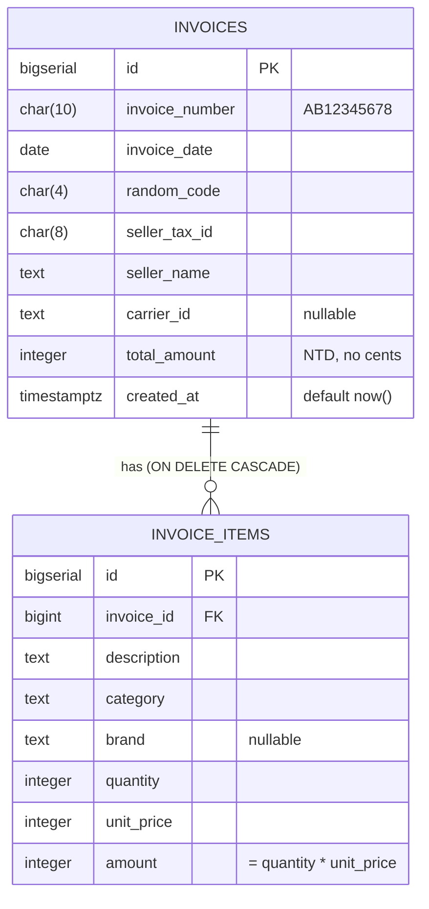

- **Natural key:** `UNIQUE (invoice_number, invoice_date)` — the number alone isn't unique
  (bimonthly reuse), so it's paired with the date. This is the conflict target that makes ingest
  idempotent.
- The **NDJSON record** (generator output) maps 1:1 onto these columns; `items[]` becomes
  `invoice_items` rows. The Ajv schemas in `invoice.schema.js` mirror the same shape and are the
  validation contract at the boundary.
- **`ground_truth.json`** (a generator artifact, not a DB table): `{enabled, start_day,
  start_date, lift, brand, brand_shift, exposed_fraction, n_households, n_exposed,
  exposed_carrier_ids[]}` — the truth the analytics dashboard's detected lift is checked against.
- **`schema_migrations(filename PK, applied_at)`** — bookkeeping for the migration runner.

---

## API Endpoints

Base URL: `http://localhost:8473`.

| Method & path | Body / query | Success | Errors |
| --- | --- | --- | --- |
| `POST /api/invoices` | one invoice | `201 {status:'created', id}` / `200 {status:'duplicate'}` | `400` schema, `422` total≠Σitems, `500` DB |
| `POST /api/invoices/batch` | array 1–500 | `200 {created, duplicates, rejected:[{index,reason}]}` | `400` not-an-array, `500` DB (whole batch rolled back) |
| `GET /api/stats/daily` | `from`, `to` (dates) | `200 [{day, invoice_count, total_amount}]` | `400` bad query |
| `GET /api/stats/category-daily` | `category`, `from`, `to` | `200 [{day, category, quantity, amount}]` | `400` bad query |
| `GET /metrics` | — | `200` Prometheus text | — |
| `GET /healthz` | — | `200 {status:'ok', db:true}` | `503` when DB down |

Single-invoice ingestion request flow:

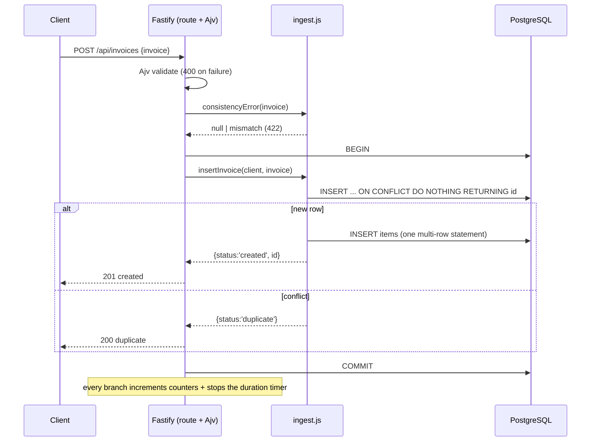

---

## Runtime Flow

### Server startup & shutdown

```mermaid
sequenceDiagram
  participant N as node src/server.js
  participant A as app.js (buildApp)
  participant DB as db.js (Pool)
  participant M as metrics.js (Registry)
  N->>A: buildApp()  (registers routes; Ajv removeAdditional:false)
  A->>M: import side-effect → collectDefaultMetrics + custom metrics
  N->>DB: import side-effect → new Pool(env) + on('error') handler
  N->>N: listen({port:8473, host:0.0.0.0})
  Note over N: SIGINT/SIGTERM → app.close() → pool.end() → exit(0)
```

The DB pool and metrics registry are created **lazily at import time** (module side-effects), so
simply importing `db.js`/`metrics.js` wires them up. There is no explicit "config load" phase —
configuration is read from `process.env` at the point of use (`db.js`, `server.js`).

### Generator run

`config.yaml` → `cache_key` → (cache hit ⇒ `cache.load`) | (miss ⇒ `generate` → `cache.save`) →
`write_ndjson` + `ground_truth.json`. See the `main()` flowchart above.

---

## Call Graphs

**Request handling (batch):**
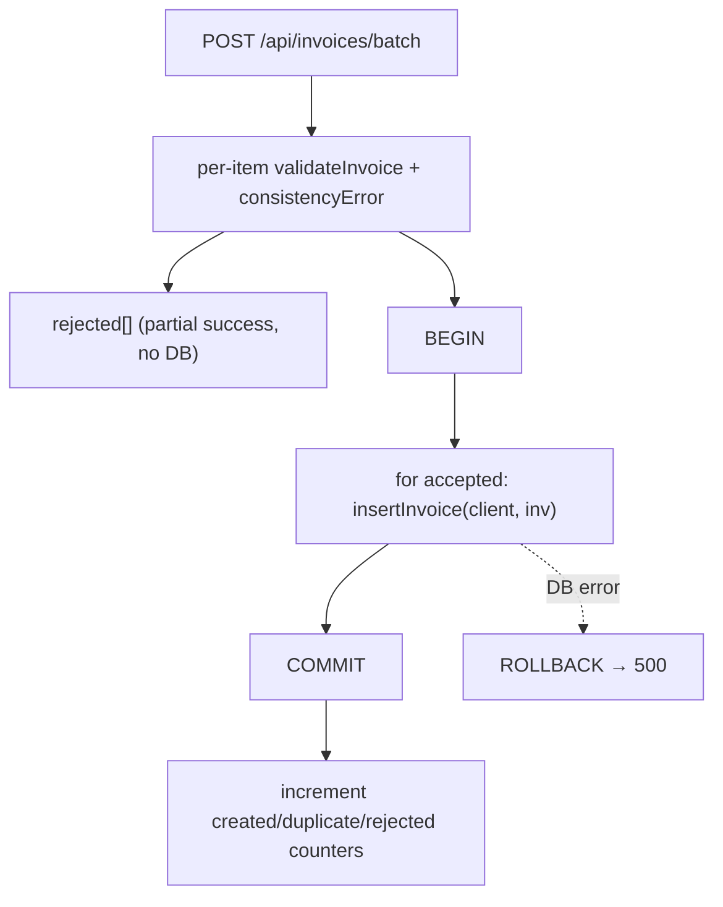

**Bulk replay (operational):**
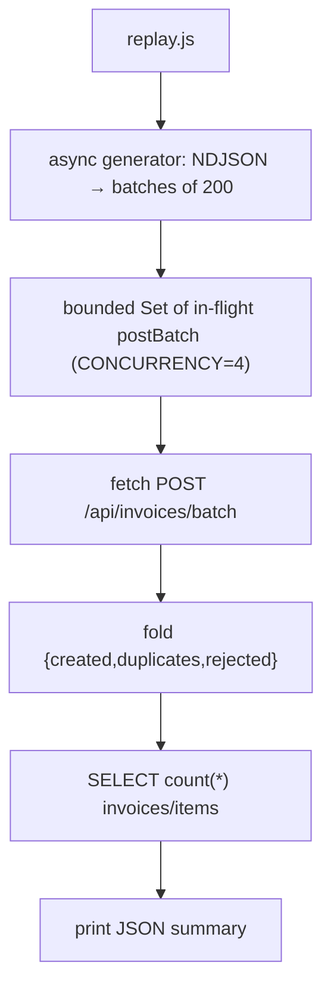

**Migrations:**
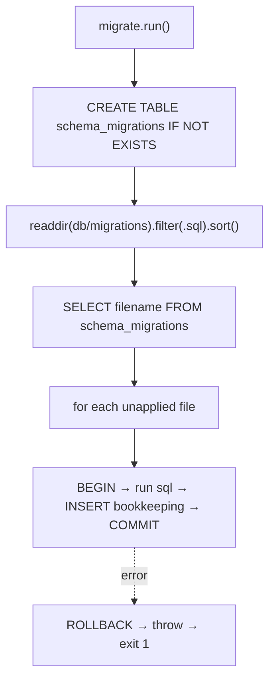

---

## State Machines

**Per-invoice ingestion outcome:**

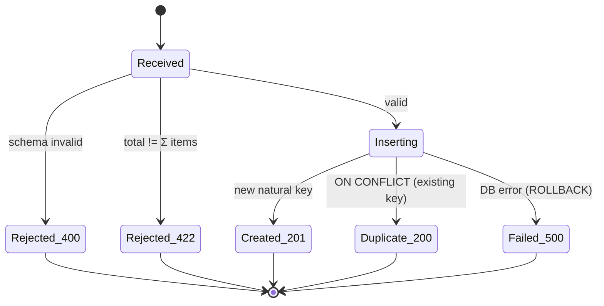

**Campaign exposure over simulated time** (per exposed household):

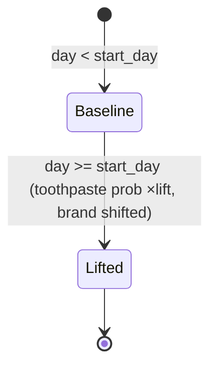

---

## Concurrency

| Context | Mechanism | Shared resource | Synchronization |
| --- | --- | --- | --- |
| **Fastify server** | Node single-threaded event loop; async/await | `pg.Pool` (connections) | each request checks out a client, wraps work in `BEGIN/COMMIT`, and `release()`s in `finally`; the DB does the locking |
| **replay.js** | bounded in-flight `Set` + `Promise.race` | the API | `CONCURRENCY` (4) caps simultaneous POSTs; idempotent insert makes ordering irrelevant |
| **k6 VUs** | many virtual users under an arrival-rate executor | `SharedArray` (read-only) | the pool is parsed once and shared immutably — `makeMalformed` deep-clones before mutating so a VU never writes to shared data |
| **generator** | single-threaded, vectorized NumPy | one `Generator` | determinism *requires* a single draw order; no parallelism by design |
| **node:test** | concurrent test files (`node --test`) | the shared Postgres | disjoint date bands (2098/2099) keep cleanups from racing |

The open-model load executors are the conceptual centerpiece: offered RPS follows a fixed
schedule **independent of response time**, so backpressure surfaces as broken latency/error
thresholds rather than silently reduced load.

---

## External Dependencies

| Dependency | Used by | Purpose / config |
| --- | --- | --- |
| **Fastify 5** | server | HTTP framework + built-in Ajv validation. `removeAdditional:false` makes it a strict gatekeeper. |
| **Ajv 8 + ajv-formats** | server | JSON-Schema validation; `ajv-formats` supplies the `date` format. Used both inside Fastify and standalone in `ingest.js`. |
| **pg (node-postgres) 8** | server | connection pooling + parameterized SQL. |
| **prom-client 15** | server | metrics registry, default Node metrics, custom counters/histogram. |
| **PostgreSQL 16** | everything | system of record (Docker Compose). |
| **NumPy 2** | generator | vectorized RNG and the single deterministic `Generator`. |
| **Faker 25** | generator | company/seller names (seeded for determinism). |
| **PyYAML** | generator | reads `config.yaml`. |
| **PyArrow 16** | generator | zstd Parquet cache of generated datasets. |
| **Grafana k6** | loadtest | open-model load generator; optional Prometheus remote-write. |
| **Prometheus 2.55** | monitoring | scrapes `/metrics`; receives k6 remote-write; 6 h retention. |
| **Grafana 11.3** | monitoring | dashboards-as-code over Prometheus + PostgreSQL datasources. |
| **uv** | generator | Python env + dependency management (`generator/.venv`). |
| **Docker Compose** | infra | Postgres + Prometheus + Grafana. |

---

## Configuration

### Environment variables

| Variable | Default | Used by | Effect |
| --- | --- | --- | --- |
| `DATABASE_URL` | — | server | full connection string; overrides `PG*` |
| `PGHOST/PGPORT/PGUSER/PGPASSWORD/PGDATABASE` | `localhost/5432/invos/devonly/invoices` | server | DB connection fallback |
| `PORT` / `HOST` | `8473` / `0.0.0.0` | server | listen address |
| `BASE_URL` | `http://localhost:8473` | replay, k6, demo | target API |
| `BATCH_SIZE` / `CONCURRENCY` | `200` / `4` | replay.js | replay batching + parallelism |
| `BATCH_SIZE` | `50` | k6 payloads | invoices per batch request |
| `MALFORMED_RATE` | `0.02` | k6 payloads | fraction of corrupted payloads |
| `MAX_INVOICES` | `100000` | prepare.js | cap on the k6 data pool |
| `K6_PROM` | unset | Makefile | `=1` enables Prometheus remote-write |
| `K6_PROMETHEUS_RW_SERVER_URL` | `…:9090/api/v1/write` | Makefile | remote-write target |
| `K6_PROFILE` / `SKIP_K6` / `SEED` | `smoke` / `0` / `42` | demo.sh | demo knobs |
| `GRAFANA_PORT` / `GRAFANA_ADMIN_PASSWORD` | `8474` / `admin` | compose | Grafana host port / admin password |
| `WIPE_DATA` | `0` | stop-demo.sh | `=1` drops data volumes |

### Config files

- **`generator/config.yaml`** — every statistical knob: `seed`, population size & frequency
  distribution, store catalog, simulation `days`/`start_date`/`base_rate`/`weekend_factor`,
  purchase item ranges + `toothpaste_base_prob` + `quantity_weights`, the product `categories`
  (price ranges, brands, descriptions) and `category_weights`, and the **`campaign`** block
  (`enabled`, `start_day`, `exposed_fraction`, `lift`, `brand`, `brand_shift`). Set
  `campaign.enabled: false` and the PearlGuard lift disappears from the analytics dashboard.
- **CLI overrides** — `--seed`, `--config`, `--out`, `--cache-dir`, `--regenerate`, `--no-cache`.

---

## Potential Improvements

- **No config validation in the generator.** `config.yaml` is trusted; a malformed value
  surfaces as a deep stack trace rather than a friendly error. A schema (e.g. Pydantic) would
  help. **(assumption: none observed)**
- **`replay.js` whole-batch rejection is coarse.** A failed batch counts *all* items as
  `rejected` (it can't tell duplicate from error), which slightly muddies the summary vs. the
  per-item batch endpoint.
- **`carrier_id` is the de-facto household identity in the data but isn't indexed.** Any future
  per-household analytics (e.g. validating exposure) would scan.
- **Single shared registry / pool as import side-effects** make unit-testing in isolation harder
  (tests need a live DB). Dependency injection would decouple them.
- **`invoices.js generate()` is a large function** mixing config unpacking, the day loop, and
  item construction. Extracting "simulate one shopper-day" would aid readability.
- **No ret# / dead-letter path** for ingestion failures beyond the 500 — acceptable for a demo,
  but a real collector would queue and retry.
- **Stress profile documents a "wall" in prose** (`loadtest/README.md`) rather than asserting it,
  so the failure point can drift silently as hardware changes.

---

## Summary

### Architectural strengths
- **Determinism + ground truth.** A single seeded RNG yields byte-identical data, and the
  campaign's exact exposure is recorded — so "did the dashboard detect the lift?" is a *checkable*
  question, not a vibe.
- **Idempotency as a first-class property.** `ON CONFLICT DO NOTHING` on a real natural key makes
  replays/retries safe; duplicates are a *metric*, not an error — and the load test leans on it.
- **Observes both service and data.** Prometheus (latency/throughput/Node vitals) *and* SQL
  (revenue/campaign) on one Grafana, with the k6-offered-vs-observed overlay proving open-model
  load.
- **Everything is reproducible and as-code:** SQL migrations, Grafana provisioning, k6 profiles,
  and a one-command `demo.sh`.

### Weaknesses
- Demo-grade security (anonymous Grafana, plaintext demo creds) — intentional, but not portable
  to anything shared.
- Import-time singletons couple modules to a live DB; limited input validation on the generator
  config; a couple of large functions.

### Subsystem responsibilities at a glance
- **generator/** — *truth source*: deterministic data + the injected signal.
- **server/** — *gatekeeper + system of record*: validate, idempotently persist, expose metrics.
- **db/** — *schema + natural-key idempotency*.
- **loadtest/** — *pressure + proof*: open-model load, malformed-payload hardening, DB consistency.
- **monitoring/** — *the lens*: service and data on one pane, as code.
- **scripts/Makefile/compose** — *the conductor*: bring it all up (and down) in one command.

### Files a new engineer should read first
1. `README.md` — the narrative and the five steps.
2. `server/src/ingest.js` + `server/src/routes/invoices.js` — the core ingestion contract.
3. `db/migrations/001_init.sql` — the data model and the natural key.
4. `generator/generator/invoices.py` + `campaign.py` — how the data (and its signal) is made.
5. `loadtest/lib/payloads.js` — what the load test actually does.
6. `docker-compose.yml` + `scripts/demo.sh` — how the pieces are wired and launched.
```

