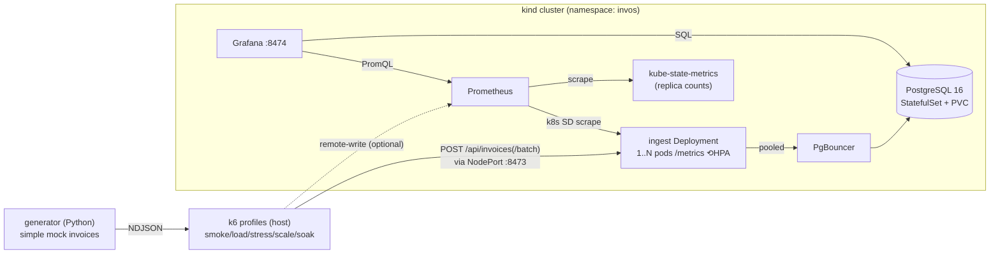

# invos-mock-demo

A small service that ingests mock Taiwanese e-invoice data into PostgreSQL, built to be
**load-tested** and **horizontally autoscaled on Kubernetes**. It has four parts: a simple
mock-invoice **generator** (Python), a Fastify **ingestion API** that validates and
idempotently persists invoices while exposing Prometheus metrics, five **k6 test profiles**
(smoke / load / stress / scale / soak), and a provisioned **Prometheus + Grafana** stack for
watching the service under load. The whole stack runs in a local **kind** cluster; the ingest
API is a scalable `Deployment` behind an HPA, so the stress/scale profile makes pods grow and
shrink with offered load.

## Architecture



## Quick start

One script brings the whole cluster up and runs the tests. Prerequisites on `PATH`: `docker`,
`kind`, `kubectl`, `node`, `uv`, `k6`.

```bash
bash scripts/run.sh up        # kind cluster + build/load image + apply manifests + migrate + generate (DB starts empty)
bash scripts/run.sh smoke     # 5 req/s, ~1 min        (quick check)
bash scripts/run.sh load      # ramp 0->100 req/s, hold 10 min
bash scripts/run.sh stress    # step 100->800 req/s until a threshold breaks
bash scripts/run.sh scale     # ramp UP then DOWN — watch pods grow then shrink (HPA demo)
bash scripts/run.sh soak      # 50 req/s, 60 min
bash scripts/run.sh down      # delete the cluster  (WIPE_DATA=1 also drops the Postgres PVC)
```

Watch the autoscaler react: `kubectl get hpa,pods -n invos -w`, and open the Grafana
**"Autoscaling — replicas vs offered load vs p99"** panel.

Each profile runs with the Prometheus overlay on — open **Grafana at
http://localhost:8474** ("System Performance" dashboard) to watch offered load vs.
server-observed rate, latency p50/p95/p99, invoice outcomes, and Node vitals live.

Knobs for `up`: `COUNT` (invoices to generate, default 100000), `SEED` (default 42).

## The four tests

`loadtest/` drives `POST /api/invoices/batch` with batches of 50 invoices drawn from the
generated pool, injects ~2% malformed payloads (asserting 4xx, never 5xx), and enforces
latency/error thresholds. The profiles use k6 **arrival-rate** executors (open model), so a
slowing server shows up as broken thresholds rather than silently reduced load. They are also
available directly via the Makefile (`make k6-smoke|k6-load|k6-stress|k6-scale|k6-soak`,
`make k6-verify` for post-run DB checks); set `K6_PROM=1` to push k6's metrics to Prometheus.
See `loadtest/README.md` for thresholds and the documented stress failure point.

## Kubernetes & autoscaling

The stack runs in a kind cluster — see **`k8s/README.md`** for the manifests, how to apply
them by hand, the HPA options (CPU by default; an opt-in custom requests/second metric via
prometheus-adapter), and the PgBouncer + `PG_POOL_MAX` pooling that keeps autoscaling from
exhausting Postgres. `kind-config.yaml` (repo root) maps the NodePorts onto `localhost`
(8473 ingest, 8474 Grafana, 9090 Prometheus).

## Doing it by hand

See `k8s/README.md` for the full step-by-step (cluster, image build + `kind load`, ConfigMaps,
`kubectl apply -k k8s/`, migrate Job). The generator and k6 feed still run on the host:

```bash
cd generator && uv sync && \
  uv run python -m generator --seed 42 --out data/invoices_90d.ndjson && cd ..
node loadtest/prepare.js                                # build the k6 feed
make k6-smoke                                           # run a profile against localhost:8473
```

The generator emits simple random invoices (varying commodity, quantity, price, count);
see `generator/README.md`. The data is deterministic for a given `--seed` + `config.yaml`.

> **Legacy compose path.** `docker-compose.yml` (Postgres + Prometheus + Grafana, host-run
> server) is **deprecated** in favour of the kind cluster and kept only as a one-release
> fallback. Under that path Prometheus scrapes the host via `host.docker.internal`, and with
> `ufw` enabled bridge→host packets may be dropped (scrape target `down`) — see
> `monitoring/README.md`. The Kubernetes path scrapes inside the cluster, so that issue is gone.

## API

| Method & path | Purpose |
| --- | --- |
| `POST /api/invoices` | Ingest one invoice. `201 created` / `200 duplicate` / `400` schema / `422` total ≠ Σ items. |
| `POST /api/invoices/batch` | Ingest up to 500 in one transaction; returns `{created, duplicates, rejected}`. |
| `GET /api/stats/daily?from&to` | Daily `{day, invoice_count, total_amount}`. |
| `GET /api/stats/category-daily?category=&from&to` | Daily `{day, category, quantity, amount}`. |
| `GET /metrics` | Prometheus metrics. |
| `GET /healthz` | DB connectivity check. |

Idempotency comes from `ON CONFLICT (invoice_number, invoice_date) DO NOTHING` — so replays
and retries are safe and duplicates are a tracked metric, not an error.

## Stack

- Node.js 20 + Fastify (`server/`), `prom-client` metrics, containerized (`server/Dockerfile`)
- Kubernetes on **kind**: ingest `Deployment` + HPA, PgBouncer, Postgres `StatefulSet` + PVC,
  Prometheus (k8s SD), Grafana, kube-state-metrics, metrics-server (`k8s/`)
- PostgreSQL 16, plain SQL migrations (`db/migrations/`) applied by a migrate Job
- Grafana k6 load test (`loadtest/`), including the up-and-down `scale` autoscaling profile
- Prometheus + Grafana provisioned as code (`monitoring/`)
- Python 3.12 invoice generator managed by `uv` (`generator/`)

## Cleanup

```bash
bash scripts/run.sh down                 # delete the kind cluster
WIPE_DATA=1 bash scripts/run.sh down     # same (the PVC goes with the cluster)
```
