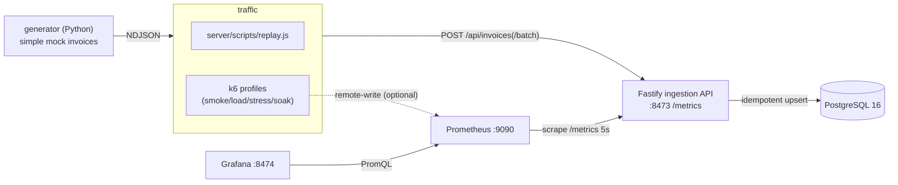

# invos-mock-demo

A small service that ingests mock Taiwanese e-invoice data into PostgreSQL, built to be
**load-tested**. It has four parts: a simple mock-invoice **generator** (Python), a Fastify
**ingestion API** that validates and idempotently persists invoices while exposing Prometheus
metrics, four **k6 test profiles** (smoke / load / stress / soak), and a provisioned
**Prometheus + Grafana** stack for watching the service under load.

## Architecture



## Quick start

One script brings everything up and runs the tests. Prerequisites on `PATH`: `docker`,
`node`, `uv`, `k6`.

```bash
bash scripts/run.sh up        # stack + migrate + generate data + start server (DB starts empty)
bash scripts/run.sh smoke     # 5 req/s, ~1 min        (quick check)
bash scripts/run.sh load      # ramp 0->100 req/s, hold 10 min
bash scripts/run.sh stress    # step 100->800 req/s until a threshold breaks
bash scripts/run.sh soak      # 50 req/s, 60 min
bash scripts/run.sh down      # stop everything  (WIPE_DATA=1 also drops volumes)
```

Each profile runs with the Prometheus overlay on — open **Grafana at
http://localhost:8474** ("System Performance" dashboard) to watch offered load vs.
server-observed rate, latency p50/p95/p99, invoice outcomes, and Node vitals live.

Knobs for `up`: `COUNT` (invoices to generate, default 100000), `SEED` (default 42).

## The four tests

`loadtest/` drives `POST /api/invoices/batch` with batches of 50 invoices drawn from the
generated pool, injects ~2% malformed payloads (asserting 4xx, never 5xx), and enforces
latency/error thresholds. The profiles use k6 **arrival-rate** executors (open model), so a
slowing server shows up as broken thresholds rather than silently reduced load. They are also
available directly via the Makefile (`make k6-smoke|k6-load|k6-stress|k6-soak`,
`make k6-verify` for post-run DB checks); set `K6_PROM=1` to push k6's metrics to Prometheus.
See `loadtest/README.md` for thresholds and the documented stress failure point.

## Doing it by hand

```bash
docker compose up -d                                   # Postgres + Prometheus + Grafana
cd server && npm install && npm run migrate && cd ..   # apply db/migrations/*.sql
cd generator && uv sync && \
  uv run python -m generator --seed 42 --out data/invoices_90d.ndjson && cd ..
cd server && npm run start &                            # ingestion API on :8473 (host)
npm run replay -- ../generator/data/invoices_90d.ndjson # load the data
cd .. && make k6-smoke                                  # run a profile
```

The generator emits simple random invoices (varying commodity, quantity, price, count);
see `generator/README.md`. The data is deterministic for a given `--seed` + `config.yaml`.

> **Firewall note (ufw).** Prometheus scrapes the host server via `host.docker.internal`;
> with `ufw` enabled, bridge→host packets may be dropped, leaving the scrape target `down`.
> See `monitoring/README.md` for the one-line allow rule.

## API

| Method & path | Purpose |
| --- | --- |
| `POST /api/invoices` | Ingest one invoice. `201 created` / `200 duplicate` / `400` schema / `422` total ≠ Σ items. |
| `POST /api/invoices/batch` | Ingest up to 500 in one transaction; returns `{created, duplicates, rejected}`. |
| `GET /api/stats/daily?from&to` | Daily `{day, invoice_count, total_amount}`. |
| `GET /api/stats/category-daily?category=&from&to` | Daily `{day, category, quantity, amount}`. |
| `GET /metrics` | Prometheus metrics. |
| `GET /healthz` | DB connectivity check. |

Idempotency comes from `ON CONFLICT (invoice_number, invoice_date) DO NOTHING` — so replays
and retries are safe and duplicates are a tracked metric, not an error.

## Stack

- Node.js 20 + Fastify (`server/`), `prom-client` metrics
- PostgreSQL 16 via Docker Compose, plain SQL migrations (`db/migrations/`)
- Grafana k6 load test (`loadtest/`)
- Prometheus + Grafana provisioned as code (`monitoring/`)
- Python 3.12 invoice generator managed by `uv` (`generator/`)

## Cleanup

```bash
bash scripts/run.sh down                 # stop processes + compose down (keep volumes)
WIPE_DATA=1 bash scripts/run.sh down     # also drop the data volumes (clean slate)
```
