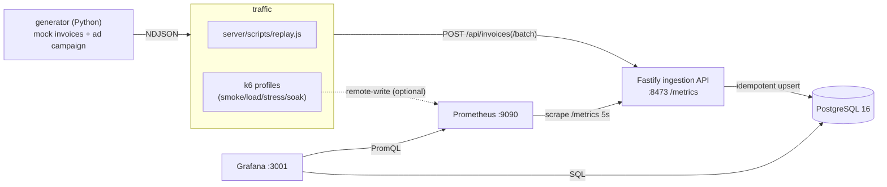

# invos-mock-demo

A small demo project that ingests mock Taiwanese e-invoice data into a local PostgreSQL
database for testing and development. It is built up in five steps and this repo implements
**all of them**: a Fastify server on Dockerized PostgreSQL 16 (Step 1), a Python data
generator that emits mock invoices as NDJSON with a built-in ad-campaign effect (Step 2), an
ingestion API that validates and persists invoices idempotently while exposing Prometheus
metrics (Step 3), a Grafana k6 load test that replays the data under smoke/load/stress/soak
profiles (Step 4), and a provisioned Prometheus + Grafana monitoring stack with two
dashboards-as-code (Step 5).

## 5-minute demo

```bash
bash scripts/demo.sh          # compose up → migrate → generate → replay → k6 → print URLs
```

Then open **Grafana at http://localhost:3001** (anonymous viewer). See `scripts/README.md`
for knobs (`K6_PROFILE=load`, `SKIP_K6=1`, …).

## Architecture



Prometheus and Grafana observe **both sides**: the service (via `/metrics`) and the data (via
SQL). k6 can push its own metrics to Prometheus so offered load and server-observed load sit on
one chart — the visual proof of open-model load testing.

## Quickstart (end to end: generate → migrate → serve → replay → query)

```bash
# 0. Postgres
docker compose up -d postgres

# 1. Generate mock invoices (Step 2) — writes generator/data/invoices_90d.ndjson
cd generator && uv sync && uv run python -m generator --seed 42 --out data/invoices_90d.ndjson
cd ..

# 2. Migrate the schema and start the ingestion server (Step 1 + 3)
cd server && npm install && npm run migrate && npm run start &
curl localhost:8473/healthz                       # -> {"status":"ok","db":true}

# 3. Replay the generated file into the API (Step 3)
npm run replay -- ../generator/data/invoices_90d.ndjson
# -> { sent, created, duplicates, rejected, elapsed_s, db_invoices, db_items }
# Replaying again reports 100% duplicates and leaves the row counts unchanged (idempotent).

# 4. Query the read-back aggregates
curl "localhost:8473/api/stats/daily?from=2025-01-01&to=2025-01-03"
curl "localhost:8473/api/stats/category-daily?category=toothpaste"
curl localhost:8473/metrics                       # Prometheus metrics
```

## API (Step 3 — ingestion)

| Method & path | Purpose |
| --- | --- |
| `POST /api/invoices` | Ingest one invoice. `201 {status:"created", id}` on a fresh insert, `200 {status:"duplicate"}` if it already exists, `400` on schema failure, `422` if `total_amount` ≠ Σ item amounts. |
| `POST /api/invoices/batch` | Ingest up to 500 invoices in one transaction. Returns `{created, duplicates, rejected:[{index, reason}]}`; validation rejects are partial-success, a DB error rolls the whole batch back. |
| `GET /api/stats/daily?from&to` | Daily `{day, invoice_count, total_amount}`. |
| `GET /api/stats/category-daily?category=&from&to` | Daily `{day, category, quantity, amount}`. |
| `GET /metrics` | Prometheus metrics: `invos_ingest_requests_total`, `invos_ingest_invoices_total`, `invos_ingest_duration_seconds`, plus default Node process metrics. |
| `GET /healthz` | DB connectivity check. |

Validation is enforced with Fastify's built-in JSON Schema (strict: unknown fields are
rejected). Idempotency comes from an `ON CONFLICT (invoice_number, invoice_date) DO NOTHING`
insert — the natural key, since Taiwanese invoice numbers are only unique per bimonthly period.

**Measured locally:** the default 90-day file (98,060 invoices / 343,054 items) replays in
~13 s; p95 single-invoice insert latency is well under 5 ms at concurrency 8 (target ~20 ms).

## Load testing (Step 4 — k6)

`loadtest/` drives the ingestion API with [Grafana k6](https://k6.io). It replays the
generated invoices in batches of 50 against `POST /api/invoices/batch`, injects 2% malformed
payloads (asserting 400/422, never 5xx), enforces latency/error thresholds, and reports custom
counters (`invos_created`, `invos_duplicates`, `invos_rejected`). Four profiles — smoke, load,
stress, soak — are wired to Makefile targets:

```bash
make k6-smoke    # 5 req/s, 1 min
make k6-load     # ramp 0->100 req/s, hold 10 min
make k6-stress   # step 100->200->400->800 req/s until a threshold breaks
make k6-soak     # 50 req/s, 60 min
make k6-verify   # DB consistency checks after a run (loadtest/verify.sql)
```

See `loadtest/README.md` for design notes, env vars, the optional Prometheus output, and the
documented **stress failure point**. The k6 data feed (`loadtest/data/chunks.json`) is
generated and git-ignored.

## Monitoring (Step 5 — Prometheus + Grafana)

`docker compose up -d` brings up Prometheus (`:9090`) and Grafana (`:3001`), both provisioned
as code from `monitoring/` — datasources and two dashboards auto-load with zero manual clicks:

- **System Performance** (Prometheus): request rate by status, latency p50/p95/p99, invoice
  outcome rates, Node event-loop/heap/CPU, and **k6 offered load vs server-observed rate**.
- **Invoice Analytics** (PostgreSQL): daily counts & revenue, top categories, weekend lift,
  and **toothpaste daily quantity by brand** — with the campaign on, the **PearlGuard** line
  visibly lifts after **2025-02-15**; turn `campaign.enabled: false` in the generator config and
  it stays flat. All panels query by `invoice_date` (event time), not `created_at` (ingest time).

Grafana is at http://localhost:3001 (anonymous viewer; admin `admin`/`${GRAFANA_ADMIN_PASSWORD:-admin}`).
If port 3001 is taken, set `GRAFANA_PORT`. See `monitoring/README.md` for details (including a
Linux/ufw firewall note for the host scrape). Screenshots:

<!--  -->
<!--  -->

## Design notes

- **Idempotent ingest.** `ON CONFLICT (invoice_number, invoice_date) DO NOTHING` makes replays
  and retries safe; duplicates are a tracked metric, not an error.
- **Open-model load.** k6 uses arrival-rate executors, so a slowing server shows up as broken
  latency thresholds — not as silently reduced load. The system dashboard overlays k6's offered
  rate with the server-observed rate to make this visible.
- **Event-time analytics.** Dashboards aggregate by `invoice_date` (when the purchase happened),
  not `created_at` (when we ingested it) — the event-time vs processing-time distinction.
- **Campaign ground truth.** The generator embeds a known ad-campaign effect and records exactly
  who was exposed in `generator/data/ground_truth.json`, so the dashboard's detected lift can be
  checked against the truth.

## Stack

- Node.js 20 + Fastify (`server/`)
- Grafana k6 load test (`loadtest/`)
- Prometheus + Grafana, provisioned as code (`monitoring/`)
- PostgreSQL 16 via Docker Compose / OrbStack (`docker-compose.yml`)
- Plain SQL migrations with a tiny runner (`db/migrations/`, `server/scripts/migrate.js`)
- Prometheus client (`prom-client`) for ingestion metrics
- Python 3.12 + Faker data generator (`generator/`, managed by `uv`)

## Configuration

The server reads `DATABASE_URL`, or falls back to `PGHOST` / `PGPORT` / `PGUSER` /
`PGPASSWORD` / `PGDATABASE` with localhost demo defaults that match `docker-compose.yml`.

## Tests

```bash
cd server && npm test   # requires the compose Postgres to be running and migrated
```

## Future work (out of scope)

No Kubernetes (stays on Docker Compose), no Grafana alerting rules, and no auth hardening —
the stack uses demo-only credentials and anonymous Grafana access on purpose.

## Cleanup

Return the machine to a pristine state:

```bash
# Stop the host ingestion server (if started via demo.sh)
kill "$(cat /tmp/invos-server.pid)" 2>/dev/null || true

# Tear down containers AND their volumes (Postgres data, Prometheus/Grafana state)
docker compose down -v

# Reclaim space from pulled images/build cache
docker system prune -f

# Remove the repo
cd .. && rm -rf invos-mock-demo

# Uninstall the toolchain (Homebrew / macOS)
brew uninstall k6
brew uninstall node
brew uninstall uv
brew uninstall --cask docker   # or: brew uninstall orbstack
```

> The build steps are described in `steps/`. Feed them one at a time, in order, verifying each
> step's acceptance criteria before starting the next.
