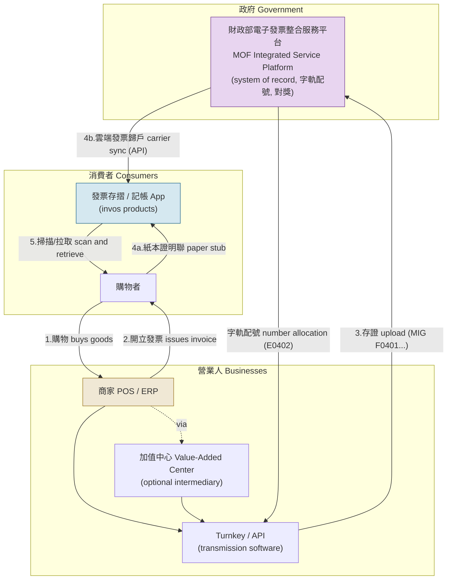
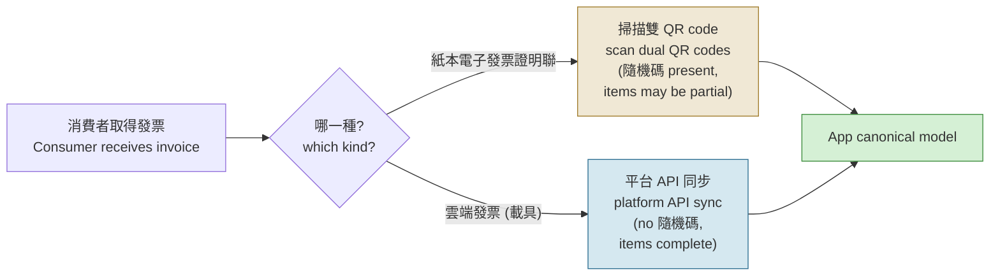
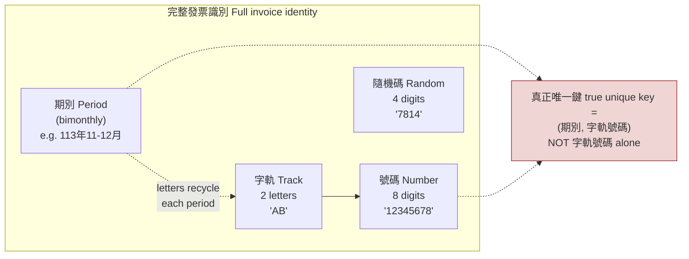
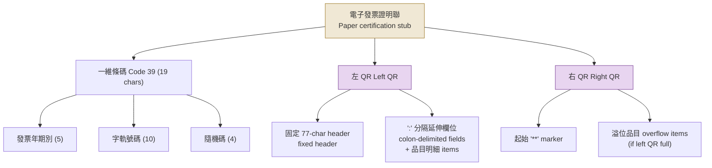
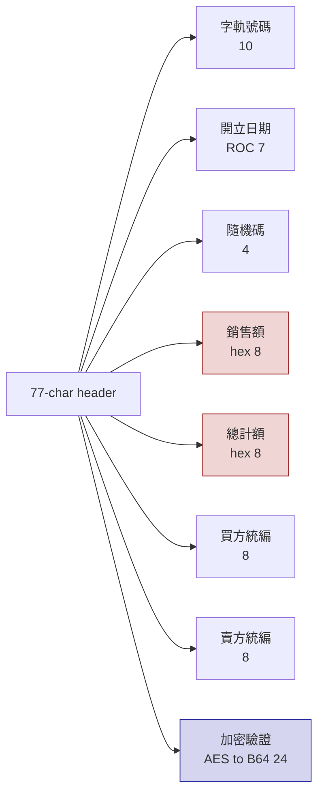
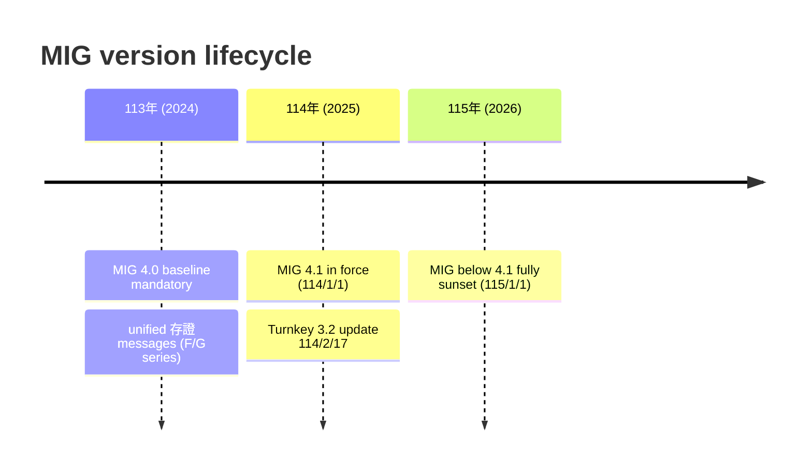
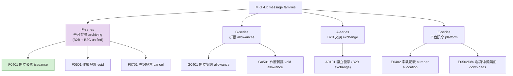
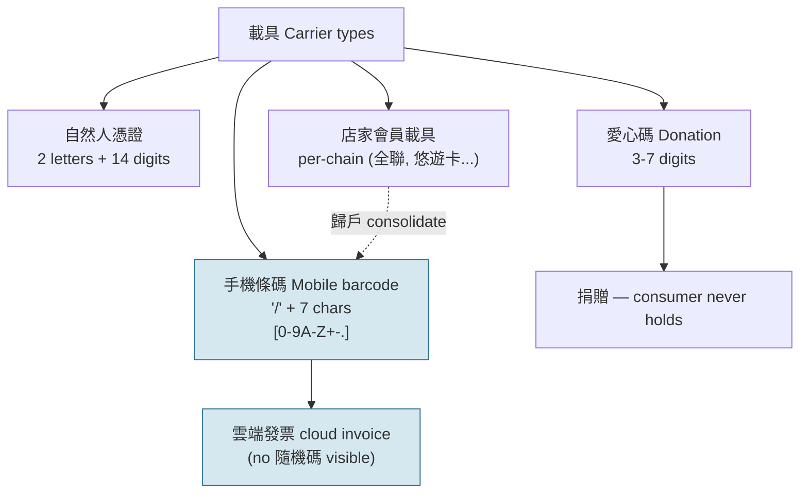
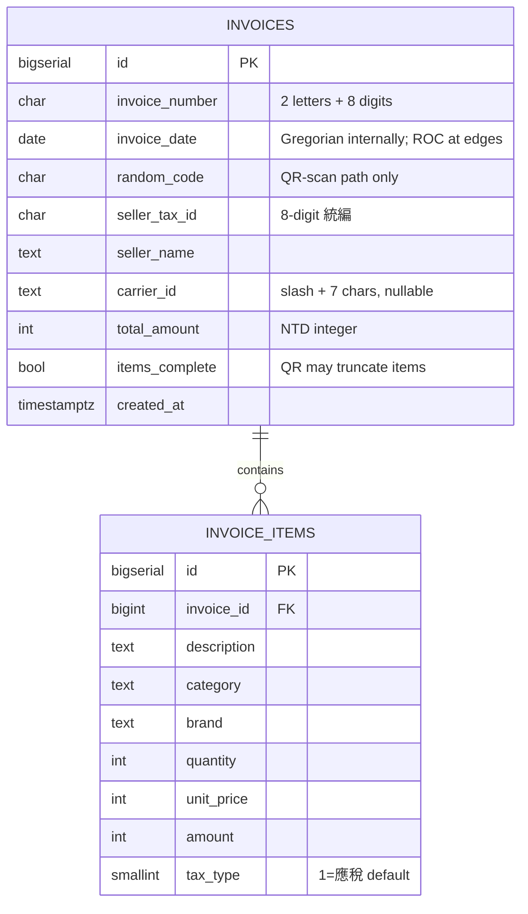
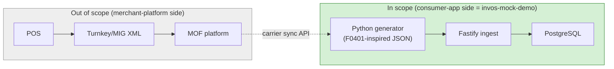

# 台灣電子發票數據格式研究 — ReceiptVault / invos-mock-demo 參考文件

**Purpose:** Ground the mock data generator and ingestion schema in the *real* Taiwanese e-invoice formats, so the demo speaks invos's native data language (發票存摺 scans these QR codes; invosData aggregates this data).

**Sources:** 財政部電子發票整合服務平台 (einvoice.nat.gov.tw) official specs — 「電子發票證明聯一維及二維條碼規格說明」v1.9 (2022), Turnkey v3 / MIG 4.0 announcements — plus value-added-center (加值中心) integration docs. URLs at the end.

**Caveat:** Field-level details reflect the official specs as published; the MIG standard is still revised periodically, so re-verify the current MIG 4.1 PDF from the platform before final implementation.

---

## 1. The ecosystem — who are the actors

Three actor groups exchange invoice data, with the government platform sitting at the center as the system of record.

**Reading the flow:** a shopper buys goods (1), the merchant issues an invoice (2), the merchant (directly or via a value-added center) uploads the invoice for archiving to the MOF platform using MIG messages and in return receives number-range allocations (3). The consumer then receives invoice data through one of two channels — a **paper certification stub** they scan, or a **cloud invoice filed under their carrier** that an app pulls from the platform (4a/4b).

For an app like 發票存摺, the two acquisition channels are the crux:

This dual reality is exactly what our ingest API should mirror: **two external shapes, one canonical internal model.**

---

## 2. 發票字軌號碼 — the universal key

| Component | Format | Example | Notes |
|---|---|---|---|
| 字軌 (track letters) | 2 uppercase letters | `AB` | Assigned per 期別 by the MOF; differs by invoice type |
| 號碼 | 8 digits | `12345678` | Sequential ranges allocated to each 營業人 |
| Full number | 10 chars | `AB12345678` | Unique **within one 期別 only** — letters recycle across periods |
| 期別 (period) | Bimonthly | 113年11-12月 | Two calendar months per period, aligned to the lottery |
| 隨機碼 | 4 digits | `7814` | Per-invoice random code, used for lottery verification and API queries |

**Engineering consequence:** the true unique key is **(期別, 字軌號碼)**, not the number alone. Our schema keys invoices on `(invoice_number, invoice_date)` — getting this wrong is a classic real-world dedup bug, so we design around it from day one.

Dates throughout use **民國年 (ROC calendar)**: ROC year = Gregorian − 1911, e.g., 2026-06-12 → `1150612` (7 chars, yyyMMdd).

---

## 3. 電子發票證明聯 — the paper stub (1D + dual QR)

Per the official spec 「電子發票證明聯一維及二維條碼規格說明」(v1.9), the printed stub carries one Code 39 barcode and two QR codes side by side.

### 3.1 一維條碼 (Code 39), 19 chars

| Field | Length | Example | Meaning |
|---|---|---|---|
| 發票年期別 | 5 | `11312` | ROC year (3) + even month of period (2) → 113年11-12月期 |
| 發票字軌號碼 | 10 | `AB12345678` | |
| 隨機碼 | 4 | `7814` | |

### 3.2 左方二維條碼 — fixed 77-char header

| # | Field | Length | Encoding | Example / Notes |
|---|---|---|---|---|
| 1 | 發票字軌號碼 | 10 | text | `AB12345678` |
| 2 | 發票開立日期 | 7 | ROC yyyMMdd | `1150612` |
| 3 | 隨機碼 | 4 | digits | `7814` |
| 4 | 銷售額 (pre-tax) | 8 | **hexadecimal**, zero-padded | NT$143 → `0000008F` |
| 5 | 總計額 (with tax) | 8 | **hexadecimal** | NT$150 → `00000096` |
| 6 | 買方統一編號 | 8 | digits; `00000000` for B2C | |
| 7 | 賣方統一編號 | 8 | digits | seller's 統編 |
| 8 | 加密驗證資訊 | 24 | AES(字軌10+隨機碼4) → Base64 | key held by issuer/platform — **not reproducible by third parties** |

Subtotal 10+7+4+8+8+8+8+24 = **77 chars**, then `:`-separated extension fields (營業人自行使用區 10 chars or `**********`; 二維條碼記載品目筆數; 該張發票交易品目總筆數; 中文編碼參數 `0`=Big5/`1`=UTF-8/`2`=Base64; then repeating item triplets `品名:數量:單價`).

**右方二維條碼** begins with literal `**`, then continues the item list if the left QR overflowed. If both QRs can't hold all items, the remainder is simply not encoded (品目筆數 < 總筆數), so readers must treat in-QR items as a **possibly partial** view. (QR spec: V6 41×41 or larger, error correction Level L+.)

**Engineering consequences:**
- The generator can emit a faithful left-QR string per invoice with a clearly-marked *synthetic* Base64 blob for field 8 — we cannot and must not produce real AES verification data.
- The ingest API gets a realistic parsing exercise: hex amounts, ROC dates, partial item lists, Big5-vs-UTF8 flag.
- "Items may be truncated in the QR" justifies separating `invoices` (always-complete header) from `invoice_items` (possibly partial), with an `items_complete` boolean.

---

## 4. MIG — the merchant-to-platform message standard

MIG (電子發票資料交換標準訊息建置指引) is the XML message standard merchants and value-added centers use to communicate with the MOF platform via Turnkey software or API.

A key MIG 4.0 change: the separate B2B and B2C archiving (存證) message specs were merged into a **common F/G series**.

An **F0401** message carries (high level): 發票號碼, 開立日期時間, seller/buyer blocks (統編, 名稱, 地址…), 載具資訊 (carrier type + IDs), 捐贈註記/愛心碼, per-item details (品名/數量/單價/金額/**課稅別**), and totals (銷售額, 稅額, 總計).

**課稅別 (tax type) codes** — required per line item since the MIG 4 era for mixed-tax invoices:

| Code | Meaning |
|---|---|
| `1` | 應稅 (5% VAT) |
| `2` | 零稅率 zero-rated |
| `3` | 免稅 exempt |
| `4` | 應稅-特種稅率 special rate |
| `9` | 混合稅 (invoice-level marker) |

**Engineering consequence:** our canonical internal model should resemble a *simplified F0401*: header (number, ROC date, seller_id, carrier, donation flag) + items (name, qty, unit_price, amount, tax_type) + totals. We do not implement XML — JSON with the same field semantics is the right fidelity for a demo, documented as "F0401-inspired."

---

## 5. 載具 (Carriers) — attaching invoices to a consumer

| Carrier | 識別格式 | Notes |
|---|---|---|
| 手機條碼 (mobile barcode) | `/` + 7 chars | Universal consumer carrier; the leading `/` is part of the ID |
| 自然人憑證 | 2 letters + 14 digits | Citizen digital certificate |
| 店家會員載具 | per-chain | e.g. 全聯福利卡; can be 歸戶 under the 手機條碼 |
| 愛心碼 (donation) | 3–7 digits | Invoice donated to a charity; consumer never holds it |

**Cloud invoices lack the consumer-visible 隨機碼; the paper 證明聯 shows it** — so our two ingestion paths legitimately carry slightly different field sets (carrier-sync: no 隨機碼, has carrier_id; QR-scan: has 隨機碼, no carrier).

統一發票開獎 (lottery): drawn on the **25th of every odd month** for the preceding bimonthly period — the cause of the odd-month shopping spike worth modeling in the generator. Prize matching uses the invoice number's trailing digits.

---

## 6. Field mapping → invos-mock-demo schema

| Real-world field | Schema column | Fidelity decision |
|---|---|---|
| 字軌號碼 (10) | `invoice_number CHAR(10)` | 2 letters + 8 digits, per-period ranges per store |
| 期別 | derived from `invoice_date` | Uniqueness = **(number, date)** → dedup key |
| 開立日期 | `invoice_date DATE` | Convert ROC ↔ Gregorian at the API boundary |
| 隨機碼 | `random_code CHAR(4)` | QR-scan path only |
| 銷售額/總計額 | `total_amount INT` | QR parses **hex**; carrier path decimal — both normalize to NTD integers |
| 賣方統編 | `seller_tax_id CHAR(8)` | Fake-but-checksum-valid 統編s for the store catalog |
| 買方統編 | omitted (B2C `00000000`) | Documented simplification |
| 課稅別 | `items.tax_type SMALLINT` | Constant `1` for our categories; column exists for realism |
| 載具 | `carrier_id` | One 手機條碼 per household |
| 品目 | `invoice_items` + `items_complete` | QR-truncation modeled by the flag |
| 加密驗證資訊 | not stored | Synthetic placeholder in emitted QR strings only, marked fake |
| MIG XML / Turnkey | **out of scope** | We are the *consumer-app side*, not the merchant-platform side |

### Boundary of the demo

The demo deliberately models the **consumer-app side** of the ecosystem (what 發票存摺 / invosData see), not the merchant-to-government XML side. The generator produces F0401-inspired JSON; we never implement Turnkey or MIG XML.

---

## 7. Primary sources

- 電子發票證明聯一維及二維條碼規格說明 v1.9 (財政部財政資訊中心, 民國111年5月): einvoice.nat.gov.tw/static/ptl/ein_upload/attachments/1575448081679_0.pdf
- 新版 Turnkey v3.0 宣導專區 (MIG 4.0 message inventory F0401/F0501/F0701/G0401/G0501, E05xx): einvoice.nat.gov.tw/static/ptl/ein_upload/html/ENV/Turnkey-01.html
- MIG 4.1 修訂公告 (施行 114/1/1): einvoice.nat.gov.tw/ptl006w/detail/1734080167868
- MIG 3.x 落日 / 4.0 時程 (115/1/1 全面使用): ECPay 公告 5606; e首發票 MIG4.0 升級公告
- 課稅別欄位要求 (混合稅發票): 盟立加值中心 MIG4 公告 (inv.iotnet.com.tw/announce_mig4.html)
- 載具/隨機碼 consumer-side behavior: invoice.tw (發票存摺 official blog), 2025